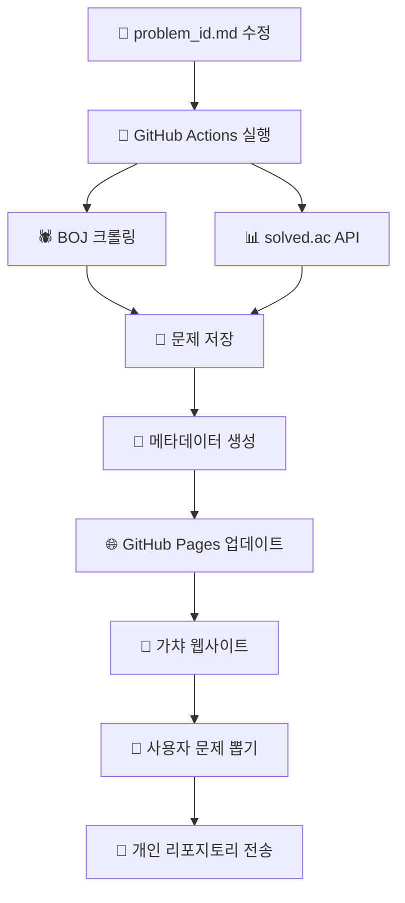

# 🎰 Algorithm Problem Gacha

**매주 새로운 알고리즘 문제를 가챠로 뽑아보세요!**

[](https://SSAFYstudyAlgoPoolja.github.io/problem-box)
[](#)
[](LICENSE)

## 🌟 주요 기능

- **🕷️ 자동 크롤링**: BOJ 문제를 자동으로 수집하고 카테고리별 분류
- **🎰 가챠 시스템**: 카테고리별로 랜덤하게 문제 뽑기 (주 3회 제한)
- **📊 스마트 분류**: solved.ac API를 통한 난이도 및 태그 기반 분류
- **🚀 자동 전송**: 뽑은 문제를 개인 리포지토리로 자동 전송
- **📈 진행 관리**: 문제 히스토리 및 스터디 진행 상황 추적

## 🎮 사용 방법

### 1. 웹사이트 접속
[🎰 Algorithm Problem Gacha](https://SSAFYstudyAlgoPoolja.github.io/problem-box)에 접속하세요.

### 2. GitHub 로그인
GitHub 계정으로 로그인하여 개인화된 서비스를 이용하세요.

### 3. 카테고리 선택
- 📊 **배열**: 구현, 시뮬레이션
- 🔍 **완전탐색**: 브루트포스, 백트래킹  
- 🕸️ **그래프**: DFS, BFS, 최단경로
- 🧠 **DP**: 다이나믹 프로그래밍
- 🔢 **수학**: 정수론, 조합론
- 📚 **자료구조**: 스택, 큐, 트리

### 4. 문제 뽑기
선택한 카테고리에서 랜덤하게 문제를 뽑아보세요! (주 3회 제한)

### 5. 문제 해결
뽑힌 문제를 해결하고, 필요시 개인 리포지토리로 전송하세요.

## 🛠️ 시스템 구조



## 📊 현재 수집된 문제

- **총 문제 수**: 자동으로 업데이트됩니다
- **카테고리별 분포**: [메타데이터](boj/problems/metadata.json)에서 확인
- **최근 업데이트**: GitHub Actions 로그 참조

## 🚀 설정 가이드

자세한 설정 방법은 [SETUP.md](SETUP.md)를 참고하세요:

1. **GitHub Token 설정**: 크롤링 권한을 위한 토큰 생성
2. **GitHub Actions**: 자동 크롤링 워크플로우 활성화  
3. **GitHub Pages**: 가챠 웹사이트 배포
4. **GitHub App**: 개인 리포지토리 연동 (선택사항)

## 📈 스터디 활용 방법

### 주간 스터디 플랜
1. **월요일**: 새로운 주 시작, 사용 횟수 초기화
2. **화/목/토**: 각자 가챠로 문제 뽑기 (주 3회)
3. **일요일**: 한 주 동안 푼 문제 리뷰 및 공유

### 팀 도전
- **카테고리 도전**: 특정 카테고리 집중 공략
- **난이도 도전**: 점진적으로 높은 난이도 도전
- **스피드 도전**: 제한 시간 내 문제 해결

## 🤝 기여하기

프로젝트 개선에 참여해주세요!

### 문제 추가
`boj/problem_id.md` 파일에 새로운 문제 ID를 추가하고 커밋하세요:

```markdown
--start
1000
1001
2557
새로운_문제_번호
--end
```

### 기능 개선
1. 이 리포지토리를 Fork
2. 새로운 브랜치 생성 (`git checkout -b feature/amazing-feature`)
3. 변경사항 커밋 (`git commit -m '✨ Add amazing feature'`)
4. 브랜치에 Push (`git push origin feature/amazing-feature`)
5. Pull Request 생성

## 📄 라이선스

이 프로젝트는 MIT 라이선스 하에 배포됩니다. 자세한 내용은 [LICENSE](LICENSE) 파일을 참고하세요.

## 🏆 만든 사람들

**SSAFY Algorithm Study Group**
- 🎯 스터디 효율성 향상을 위한 도구 개발
- 🤖 자동화를 통한 반복 작업 최소화
- 🎮 게임화를 통한 학습 동기 부여

---

<div align="center">

**🎰 행운을 빌어요! 좋은 문제가 나오길!**

[🌟 Star](../../stargazers) • [🍴 Fork](../../fork) • [🐛 Issue](../../issues) • [💡 PR](../../pulls)

</div>
